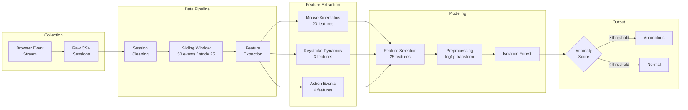
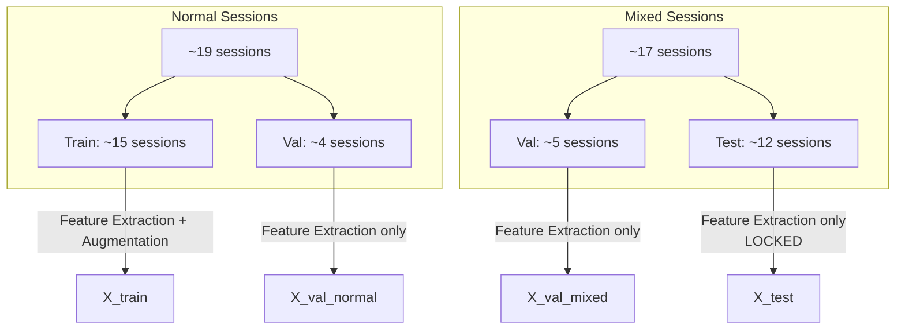
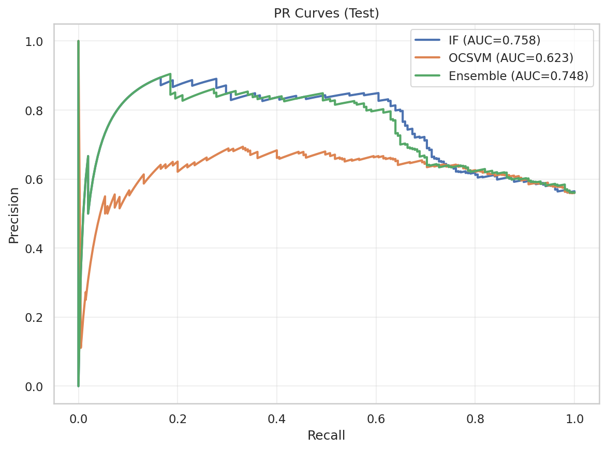
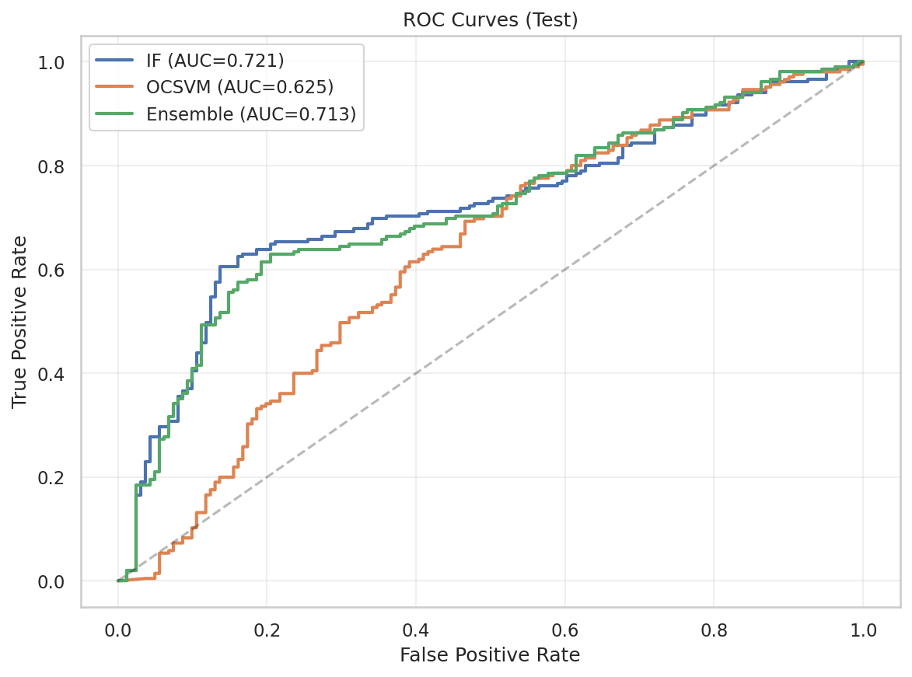
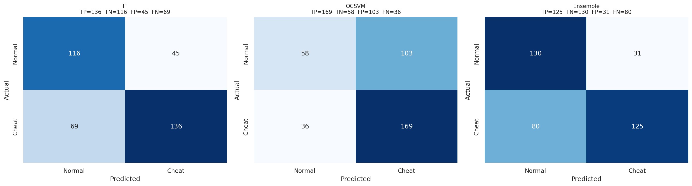
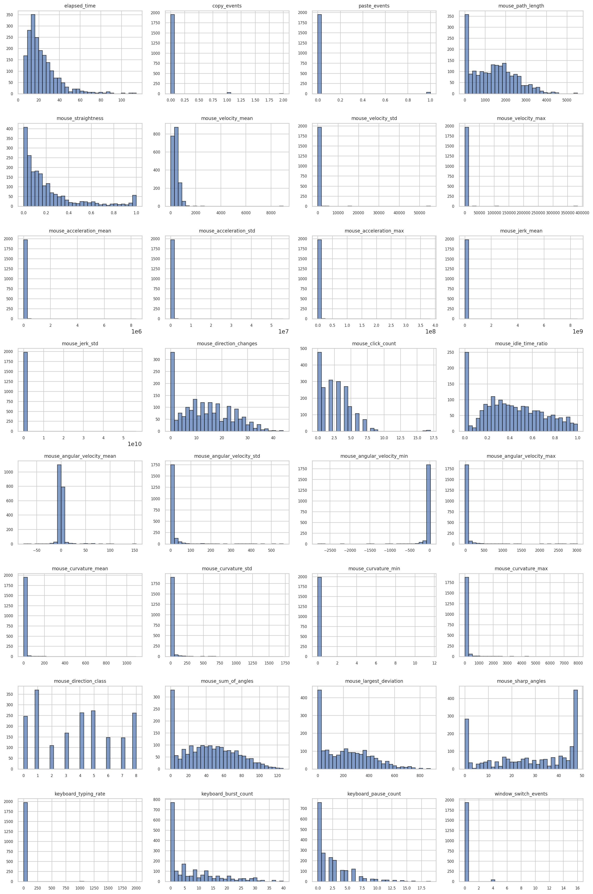
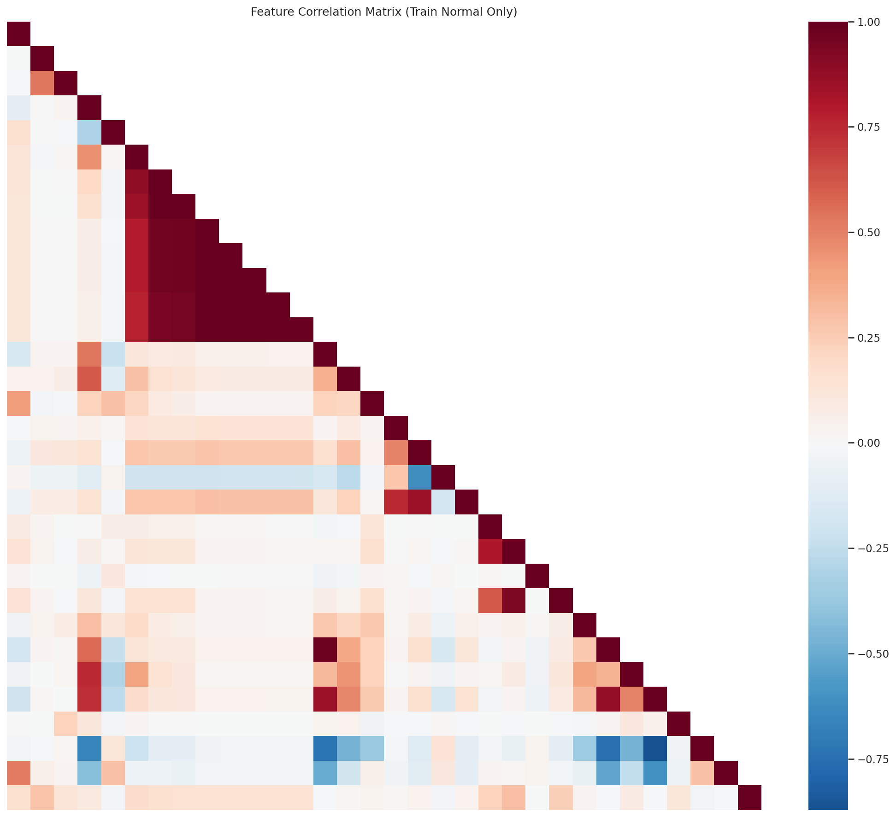
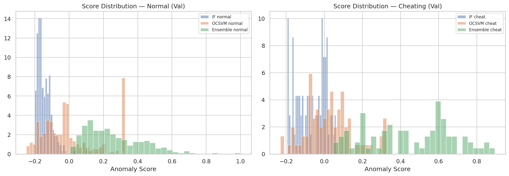
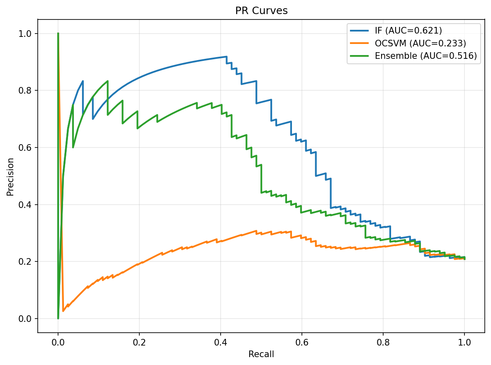
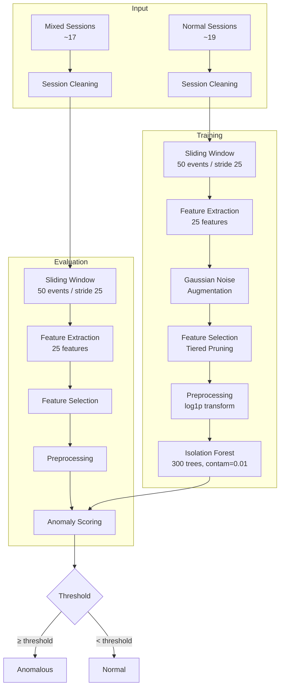

# Behavioral Anomaly Detection for Academic Integrity Monitoring

## A Privacy-Preserving Approach to Cheating Detection via Mouse and Keyboard Dynamics

---

## 1. Motivation

The mass adoption of remote examinations, accelerated by the COVID-19 pandemic, has created an urgent need for reliable academic integrity monitoring. Traditional proctoring approaches — live human proctors, webcam-based AI surveillance, and browser lockdown software — each carry fundamental limitations: high cost at scale, privacy invasion, or vulnerability to circumvention via secondary devices.

This project explores an alternative paradigm: **passive behavioral biometrics** captured from browser-level mouse and keyboard interactions. Rather than recording video or locking down the operating system, the system collects only Human-Computer Interaction (HCI) event streams — cursor coordinates, keystroke timings, and browser focus events — which contain no personally identifiable information by themselves. The core hypothesis is that cheating behavior disrupts fine motor control and interaction patterns in measurable ways, producing detectable deviations from a student's normative exam-taking behavior.

### 1.1 Why Behavioral Biometrics?

Current proctoring solutions fall into three categories, each with significant shortcomings:

| Approach | Key Limitation |
|---|---|
| **Human proctors** | Cost-prohibitive at scale; subject to fatigue and bias |
| **Video-based AI** (eye tracking, gaze estimation) | Privacy-invasive; computationally expensive; ethical concerns |
| **Browser lockdown** | Easily bypassed with secondary devices; requires kernel-level access |

Behavioral biometrics occupies an under-explored intersection: it is **privacy-preserving** (no webcam, no screen recording), **web-native** (runs entirely in browser-side JavaScript), and **scalable** (lightweight feature extraction with classical ML models). Recent research has demonstrated that keystroke dynamics encode cognitive state information — including mental fatigue (Acien et al., 2022) and cognitive load during examinations (Moganapriya et al., 2025) — while mouse kinematics reflect attentional processes and decision-making (Yechiam et al., 2017). Browser-level events such as window switching and clipboard usage have been shown to cluster with cheating behavior in proctored settings (Akçapınar, 2025).

This project fuses all three modalities — mouse kinematics, keystroke dynamics, and discrete action events — into a unified behavioral feature space for unsupervised anomaly detection.

### 1.2 Problem Statement

Given a stream of timestamped HCI events $E = \{e_1, e_2, \dots, e_N\}$ captured during an online exam session, where each event $e_i = (t, \text{type}, x, y, \text{key}, \text{action})$, the system must:

1. **Segment** $E$ into overlapping temporal windows $W_j$ of size $k = 50$ events with stride $s = 25$
2. **Extract** a feature vector $\mathbf{f}_j \in \mathbb{R}^{25}$ encoding kinematic, spatial, and action-based descriptors per window
3. **Classify** each window as $\{normal, anomalous\}$ using a one-class classifier $\mathcal{C}$ trained exclusively on normal (non-cheating) behavior

The problem is fundamentally one of **unsupervised behavioral anomaly detection in multivariate time-series HCI data under data-scarcity constraints**.

---

## 2. System Architecture

The system follows a modular pipeline architecture, from raw event ingestion through feature extraction, model inference, and anomaly reporting.

### 2.1 Data Collection

The system captures three categories of browser-level events through a JavaScript listener embedded in the examination platform:

| Event Category | Captured Data | Examples |
|---|---|---|
| **Mouse events** | X/Y coordinates, timestamps | `mousemove`, `click` |
| **Keyboard events** | Key codes, timestamps | `keydown`, `copy`, `paste` |
| **Action events** | Browser state changes | `tab-switch`, `blur`, `focus` |

Each event is timestamped and optionally annotated with a cheating flag for ground-truth labeling during development.

### 2.2 Data Cleaning

Raw sessions undergo standardized cleaning:

- Removal of session summary footer rows
- Type coercion of timestamps and coordinates
- Forward-filling of missing X/Y coordinates (keyboard events do not carry cursor position)
- Creation of boolean event-category flags (`is_mouse_event`, `is_keyboard_event`)
- Binary action flags (`is_copy`, `is_paste`, `is_blur`, `is_focus`, `is_tab_switch`)

### 2.3 Sliding Window Segmentation

The cleaned event stream is segmented into overlapping windows using a sliding window approach inspired by Piecewise Aggregate Approximation (Keogh et al., 2001):

- **Window size:** $k = 50$ consecutive events per chunk
- **Stride:** $s = 25$ events (50% overlap)
- **Labeling:** A chunk is labeled *cheating* if the fraction of cheating-flagged events within it meets or exceeds a threshold $\tau = 0.5$

This window size maps to the behavioral chunking hypothesis in cognitive science — the idea that human motor actions organize into meaningful groups at approximately 2–5 second intervals (Gobet et al., 2001). The 50% overlap ensures that transient anomalies occurring near window boundaries are captured in at least one complete window.

---

## 3. Feature Engineering

Each 50-event window is transformed into a 25-dimensional feature vector through domain-informed kinematic decomposition. The raw cursor trajectory $(x(t), y(t))$ is treated as a discrete point process, and features are derived through successive finite-difference differentiation and spatial analysis. Features are organized into three categories: mouse kinematics (20), keystroke dynamics (3), and action events (4), reduced to 25 after feature selection.

### 3.1 Mouse Kinematic Features

All mouse features originate from the discrete cursor positions $(x_i, y_i)$ and their associated timestamps $t_i$ for $i = 1, \dots, n$ within a window. Temporal derivatives are computed via forward finite differences.

#### 3.1.1 Temporal Derivatives

**Displacement** between consecutive events:

$$\Delta x_i = x_i - x_{i-1}, \quad \Delta y_i = y_i - y_{i-1}, \quad \Delta t_i = t_i - t_{i-1}$$

**Velocity** — the first-order temporal derivative, representing instantaneous cursor speed:

$$v_x(t_i) = \frac{\Delta x_i}{\Delta t_i}, \quad v_y(t_i) = \frac{\Delta y_i}{\Delta t_i}$$

$$v(t_i) = \sqrt{v_x(t_i)^2 + v_y(t_i)^2}$$

**Acceleration** — the second-order derivative, capturing changes in speed:

$$a_x(t_i) = \frac{\Delta v_x}{\Delta t_i}, \quad a_y(t_i) = \frac{\Delta v_y}{\Delta t_i}$$

$$a(t_i) = \sqrt{a_x(t_i)^2 + a_y(t_i)^2}$$

**Jerk** — the third-order derivative, measuring the smoothness of acceleration. High jerk indicates abrupt changes in movement force, which correlates with erratic or interrupted motor control:

$$j(t_i) = \frac{\Delta a(t_i)}{\Delta t_i}$$

All derivatives are undefined when $\Delta t_i = 0$ (simultaneous events). In such cases, the resulting $\pm\infty$ values are replaced with NaN and excluded from downstream aggregation, ensuring that degenerate measurements do not corrupt feature statistics.

#### 3.1.2 Angular Kinematics

**Direction angle** at each event is computed from the displacement vector:

$$\theta_i = \text{atan2}(\Delta y_i, \Delta x_i)$$

**Angular velocity** measures the rate of directional change. A wrapping operation is applied to angle differences to handle the $\pm\pi$ discontinuity — without it, a smooth rotation crossing the $\pm\pi$ boundary would produce a spurious $2\pi$ spike:

$$\Delta\theta_i^{\text{wrapped}} = (\theta_i - \theta_{i-1} + \pi) \bmod 2\pi - \pi$$

$$\omega(t_i) = \frac{\Delta\theta_i^{\text{wrapped}}}{\Delta t_i}$$

From the angular velocity series, four aggregate statistics are extracted: **mean**, **standard deviation**, **minimum**, and **maximum** (after feature selection, mean, std, and min are retained).

#### 3.1.3 Curvature

**Curvature** quantifies how sharply the trajectory bends at each point, derived from the Frenet-Serret formula for planar curves. It is the magnitude of the cross product of velocity and acceleration vectors, normalized by the cube of speed:

$$\kappa(t_i) = \frac{|v_x \cdot a_y - v_y \cdot a_x|}{|v|^3}$$

High curvature indicates tight turns; near-zero curvature indicates straight-line motion. When $|v| \approx 0$ (the cursor is nearly stationary), the denominator approaches zero, producing degenerate values that are replaced with NaN. Four aggregate statistics are extracted: **mean**, **standard deviation**, **minimum**, and **maximum** (after feature selection, mean, std, and min are retained).

#### 3.1.4 Path Geometry Features

**Path length** — the total distance traveled by the cursor:

$$L = \sum_{i=2}^{n} \sqrt{\Delta x_i^2 + \Delta y_i^2}$$

**Straightness ratio** (tortuosity) — the ratio of the Euclidean distance between the first and last cursor positions to the total path length. A value of 1.0 indicates perfectly straight movement; lower values indicate meandering or erratic paths:

$$S = \frac{\sqrt{(x_n - x_1)^2 + (y_n - y_1)^2}}{L}$$

**Direction changes** — the count of trajectory inflections where the absolute angular change exceeds a threshold of $\pi/4$ radians (45°):

$$D = \sum_{i=2}^{n} \mathbb{1}\left[|\theta_i - \theta_{i-1}| > \frac{\pi}{4}\right]$$

**Direction class** — an 8-sector compass classification of the net movement direction, mapping the overall displacement angle to one of 8 sectors (N, NE, E, SE, S, SW, W, NW):

$$\phi = \text{atan2}(y_n - y_1, x_n - x_1), \quad c = \min\left(\left\lfloor \frac{\phi_{\text{deg}} + 360}{45} \right\rfloor + 1, \; 8\right)$$

**Largest deviation** — the maximum perpendicular distance from any intermediate cursor position to the straight line connecting the start and end points. This captures the greatest excursion from the direct path:

$$d_i = \frac{|(y_n - y_1) \cdot x_i - (x_n - x_1) \cdot y_i + x_n y_1 - y_n x_1|}{\sqrt{(y_n - y_1)^2 + (x_n - x_1)^2}}$$

$$d_{\max} = \max_{i} \; d_i$$

**Sum of angles** — the cumulative angular displacement across the window:

$$\Theta = \sum_{i=2}^{n} |\theta_i - \theta_{i-1}|$$

**Sharp angles** — the count of inter-event angle changes exceeding a fine threshold (0.0005 radians), capturing micro-level trajectory irregularities:

$$A_{\text{sharp}} = \sum_{i=2}^{n} \mathbb{1}[|\theta_i - \theta_{i-1}| > 0.0005]$$

#### 3.1.5 Behavioral Metrics

**Click count** — the number of mouse click events within the window:

$$C = \sum_{i=1}^{n} \mathbb{1}[\text{type}_i = \text{click}]$$

**Idle time ratio** — the fraction of the window's temporal duration spent at near-zero velocity (below the 10th percentile of the window's velocity distribution). This captures periods of cursor inactivity, which may indicate the student is reading from a secondary source rather than interacting with the exam:

$$v_{\text{thresh}} = P_{10}(v), \quad R_{\text{idle}} = \frac{\sum_{i: v_i \leq v_{\text{thresh}}} \Delta t_i}{\sum_{i=2}^{n} \Delta t_i}$$

#### 3.1.6 Aggregation and Summary

From each derivative series (velocity, acceleration, jerk, angular velocity, curvature), summary statistics (mean, standard deviation, max, min) are computed over the window. After feature selection (Section 3.4), the final mouse feature set is:

| Group | Retained Features |
|---|---|
| **Velocity** | mean |
| **Acceleration** | mean |
| **Jerk** | mean |
| **Angular velocity** | mean, std, min |
| **Curvature** | mean, std, min |
| **Path geometry** | path length, straightness, direction changes, direction class, sum of angles, largest deviation, sharp angles |
| **Behavioral** | click count, idle time ratio |

### 3.2 Keystroke Dynamic Features

Keyboard features capture typing tempo and rhythm from `keydown` events within each window. Let $t_1, t_2, \dots, t_m$ be the timestamps of the $m$ keyboard events in the window.

**Typing rate** — keystrokes per second, measuring overall typing speed:

$$r = \frac{m}{t_m - t_1} \quad \text{(if } m \geq 2 \text{ and } t_m > t_1\text{)}$$

**Burst count** — the number of consecutive keypresses with inter-key gaps below 0.2 seconds, indicating rapid, uninterrupted typing:

$$B = \sum_{i=2}^{m} \mathbb{1}[t_i - t_{i-1} < 0.2\text{s}]$$

**Pause count** — the number of inter-key gaps exceeding 1.0 second, indicating hesitation, context-switching, or periods where the student stopped typing (potentially to look up an answer):

$$P = \sum_{i=2}^{m} \mathbb{1}[t_i - t_{i-1} > 1.0\text{s}]$$

These features capture typing tempo irregularities associated with cognitive load and task-switching. During normal exam-taking, typing tends to follow a consistent rhythm. Cheating activities — such as reading from a secondary source, copying text, or receiving external help — manifest as disrupted burst/pause patterns.

### 3.3 Action Event Features

Action features count discrete browser-level events that serve as direct behavioral signals.

**Elapsed time** — the temporal duration of the window:

$$T = t_n - t_1$$

**Copy events** — count of clipboard copy actions within the window:

$$N_{\text{copy}} = \sum_{i=1}^{n} \mathbb{1}[\text{action}_i = \text{copy}]$$

**Paste events** — count of clipboard paste actions:

$$N_{\text{paste}} = \sum_{i=1}^{n} \mathbb{1}[\text{action}_i = \text{paste}]$$

**Window switch events** — a merged count of three browser attention events (blur, focus, and tab-switch), all of which signal the same underlying behavior: the student left the exam window:

$$N_{\text{switch}} = \sum_{i=1}^{n} \mathbb{1}[\text{action}_i \in \{\text{blur}, \text{focus}\}] + \sum_{i=1}^{n} \mathbb{1}[\text{type}_i = \text{tab-switch}]$$

Despite being sparse in normal data (zero in approximately 95% of normal sessions), action features are retained as strong anomaly discriminators. In one-class classification, a feature that is consistently zero for normal behavior but non-zero during anomalous behavior is an ideal discriminator — the model has learned a tight distribution around zero, and any deviation is immediately flagged.

### 3.4 Feature Selection

The initial extraction produces 31 features (after merging blur, focus, and tab-switch into `window_switch_events`). A two-stage selection process reduces this to the final 25 features.

**Stage 1: Zero-variance removal.** Features with literally zero variance across all training samples are eliminated — they carry no information.

**Stage 2: Tiered correlation pruning.** For all feature pairs with Pearson correlation $|r| > 0.85$ (computed on training data only), each pair is classified:

- **Tier 1 (Drop):** Features derived from the same base signal with different aggregation functions (e.g., `velocity_mean` vs. `velocity_max`). These are redundant by construction — they measure the same underlying quantity with different statistics. The less informative aggregation (typically max or min) is dropped.
- **Tier 2 (Keep):** Features derived from different physical signals even if mathematically related (e.g., `velocity` vs. `acceleration`). While velocity and acceleration are related by differentiation, they capture distinct behavioral phenomena — speed versus change in speed — and their correlation is tolerated.

This tiered approach prevents multicollinearity and overfitting in the small-data regime while preserving the physical diversity of the feature space.

---

## 4. Data Strategy

### 4.1 Dataset

The current dataset consists of approximately 20 browser-based exam sessions collected from student volunteers. Sessions are categorized into two groups:

| Category | Count | Description |
|---|---|---|
| **Pure normal** | ~19 sessions | Students taking exams without any cheating behavior |
| **Mixed** | ~17 sessions | Sessions containing both normal and cheating segments |

**This dataset is small by necessity, not by design.** At the time of this work, the examination platform is not yet deployed for live student use, which limits data collection to controlled volunteer sessions. Collecting behavioral data at the scale required for modern deep learning approaches (thousands to tens of thousands of sessions) requires an operational platform with integrated event tracking serving real student assessments. This is planned as the immediate next phase of the project.

Given this constraint, the project deliberately favors classical machine learning approaches — which are theoretically well-understood, require fewer training samples, and offer interpretable decision boundaries — over data-hungry deep learning architectures. The current results serve as a validated baseline and proof-of-concept; as the platform launches and data collection scales, the methodology can evolve to incorporate more sophisticated models.

### 4.2 Session-Level Data Splitting

To prevent data leakage — a critical concern with overlapping sliding windows — data is split at the **session level** rather than the chunk level:

- **Training set:** Normal sessions only — the model learns what "normal" looks like
- **Validation set:** Held-out normal sessions + mixed sessions — for hyperparameter tuning and threshold selection
- **Test set:** Mixed sessions only — locked until final evaluation, touched exactly once

This subject-independent evaluation prevents leakage from overlapping windows belonging to the same session. With a stride of 25 and a window size of 50, consecutive chunks share 25 events. A naive chunk-level split would place nearly identical feature vectors in both train and test, producing artificially inflated performance — a known pitfall in behavioral biometrics research (Eberz et al., 2017).

### 4.3 Synthetic Data Augmentation

Given the small dataset, Gaussian noise augmentation is applied **exclusively to training sessions** to expand the effective training set and improve model generalization. The augmentation operates at the raw coordinate level rather than the feature level, which is critical for maintaining the physical consistency of derived kinematic quantities.

#### 4.3.1 Noise Model

For each mouse event at position $(x_i, y_i)$ in a training window, a noisy copy is generated by adding independent Gaussian noise:

$$x_i' = \text{clip}\left(x_i + \epsilon_x, \; 0, \; W\right), \quad \epsilon_x \sim \mathcal{N}(0, \sigma^2)$$

$$y_i' = \text{clip}\left(y_i + \epsilon_y, \; 0, \; H\right), \quad \epsilon_y \sim \mathcal{N}(0, \sigma^2)$$

where $(W, H) = (1920, 1080)$ are the screen bounds, and the noise standard deviation $\sigma$ is drawn uniformly per augmented copy:

$$\sigma \sim \text{Uniform}(\sigma_{\min}, \sigma_{\max}) = \text{Uniform}(2, 5) \text{ pixels}$$

The clipping operation ensures that noisy coordinates remain within the visible viewport.

#### 4.3.2 Propagation Through the Feature Pipeline

Because noise is injected at the raw coordinate level before feature extraction, it naturally propagates through all derived quantities. A perturbation $\epsilon$ in position produces:

- **Velocity perturbation:** $\Delta v \approx \frac{\epsilon}{\Delta t}$ — noise is amplified by the inverse of the time step
- **Acceleration perturbation:** $\Delta a \approx \frac{\epsilon}{\Delta t^2}$ — amplified further by the second derivative
- **Curvature perturbation:** propagated through the cross-product formula

This cascading effect means that a small positional jitter of 2–5 pixels produces realistic variation across all 25 features simultaneously, without requiring separate noise models for each derived quantity. The kinematic relationships between features (e.g., velocity and acceleration remain consistent as derivatives of the same trajectory) are preserved by construction.

#### 4.3.3 Augmentation Configuration

For each 50-event window in the training set, $n_{\text{copies}} = 2$ noisy copies are generated, each with an independently drawn $\sigma$. This triples the effective training set size (1 original + 2 augmented). Only mouse event coordinates receive noise; keyboard and action events retain their original values. Augmentation is applied **only to the training set** — validation and test data remain unaugmented to provide an honest evaluation signal.

This approach is analogous to jittering in deep learning (Simard et al., 2003) but is applied to the raw temporal signal rather than pre-computed features, ensuring physical consistency across the entire feature extraction pipeline.

---

## 5. Modeling Approach

### 5.1 Why Classical ML Over Deep Learning

The choice of classical one-class classifiers over deep learning architectures is a deliberate and necessary decision driven by the data constraint. Modern deep learning approaches for anomaly detection — Variational Autoencoders (VAEs), LSTM-based sequence models, Transformer architectures, and contrastive learning frameworks — typically require thousands to millions of training samples to learn meaningful latent representations without overfitting.

With approximately 20 sessions (~40,000 raw events yielding a few thousand feature windows after chunking, further reduced by the session-level split), the dataset is orders of magnitude too small for these approaches. A VAE trained on this data would either memorize the training set (overfitting) or collapse to a trivial latent space, rendering its reconstruction-error-based anomaly scores meaningless. Similarly, LSTMs and Transformers would lack sufficient sequence diversity to learn temporal patterns that generalize beyond the training sessions.

Classical models — particularly Isolation Forest and One-Class SVM — are theoretically well-suited to this regime:

- **Isolation Forest** makes no distributional assumptions and requires only enough samples to estimate relative data density via random partitioning. It has been shown to perform well in high-dimensional spaces with as few as hundreds of samples (Liu et al., 2012).
- **One-Class SVM** provides an optimization-based decision boundary with the $\nu$-parameter offering interpretable control over the false positive rate — critical for a proctoring system where falsely accusing a student has serious consequences.

These models, combined with domain-informed hand-crafted features, reduce the hypothesis space the model must search, making effective learning possible from limited data. **When the examination platform is deployed and data collection scales to hundreds or thousands of sessions, the methodology can be revisited to explore deep learning approaches** that may capture more complex temporal dependencies and nonlinear feature interactions.

### 5.2 Why Unsupervised Learning?

The choice of unsupervised anomaly detection over supervised classification is not merely a practical convenience — it is a fundamental requirement of the cheating detection problem. Supervised learning requires labeled examples of both classes: normal behavior and cheating behavior. While normal exam-taking behavior is relatively consistent and well-defined, **cheating behavior is open-ended, evolving, and inherently adversarial**.

The space of possible cheating strategies is effectively unbounded. A student might:

- Switch to a secondary device and read answers (producing long away-gaps and erratic mouse trajectories)
- Copy-paste from an external source (producing clipboard events without preceding typing)
- Collaborate with someone in the room (producing subtle pauses and irregular typing rhythms without any browser-level events)
- Use AI-generated answers typed manually (producing burst-pause patterns inconsistent with natural composition)
- Receive answers through a hidden communication channel (producing micro-interruptions invisible to browser events)

Each of these strategies produces a different behavioral signature, and new strategies emerge continuously as students adapt to detection methods. A supervised classifier trained on a finite set of known cheating patterns would only detect those specific patterns — it would be blind to any novel cheating strategy not represented in the training data. This is the **open-set recognition problem**: the anomalous class is not a fixed, enumerable category but an open-ended complement of the normal class.

Unsupervised anomaly detection inverts this framing. Instead of learning what cheating looks like (an impossible task given its unbounded variety), the model learns what **normal** behavior looks like — a much more constrained and well-defined distribution. Any significant deviation from this learned normal manifold is flagged as anomalous, regardless of the specific cheating strategy that produced it. This makes the system robust to novel, unseen cheating methods: as long as the cheating behavior disrupts the student's interaction patterns in a measurable way, the model can detect it without having seen that specific pattern before.

This one-class formulation also addresses a practical labeling challenge: collecting reliably labeled cheating data is difficult. Cheating sessions must be simulated by volunteers, which introduces a gap between simulated and real cheating behavior. Volunteers know they are being observed and may not replicate the stress, urgency, or subtlety of actual cheating. By training exclusively on normal data — which can be collected authentically during real exam sessions — the system avoids this simulation gap entirely.

### 5.3 One-Class Classification

The system adopts the **one-class classification** paradigm (Pimentel et al., 2014; Chandola et al., 2009): the model is trained exclusively on normal behavior and must learn a decision boundary that encloses the normal data distribution, flagging any point outside this boundary as anomalous. This is the natural operationalization of the unsupervised approach described above — the model characterizes the normal class, and everything outside it is a potential integrity violation.

Two classical one-class classifiers are evaluated:

#### Isolation Forest (Liu, Ting & Zhou, 2008)

Based on the principle that anomalies are "few and different" and therefore more susceptible to isolation via recursive random partitioning. An ensemble of isolation trees (iTrees) is constructed by recursively selecting a random feature and a random split value, partitioning the data until each point is isolated or a depth limit is reached.

The anomaly score is derived from the average path length across all trees:

$$s(x, n) = 2^{-E[h(x)] / c(n)}$$

where $h(x)$ is the path length (number of splits) to isolate point $x$, and $c(n)$ is the average path length of unsuccessful searches in a binary search tree of size $n$, used as a normalization factor:

$$c(n) = 2H(n-1) - \frac{2(n-1)}{n}, \quad H(k) = \ln(k) + \gamma \;\; (\text{Euler's constant } \gamma \approx 0.5772)$$

Anomalies, being "few and different," fall in sparse regions of the feature space and require fewer random splits to isolate — yielding shorter average path lengths and higher anomaly scores approaching 1. Normal points, residing in dense regions, require many more splits, producing scores near 0.

#### One-Class SVM (Schölkopf et al., 2000)

Maps data to a high-dimensional feature space via a kernel function $\Phi(\cdot)$, then finds a hyperplane with maximal margin from the origin that separates normal data from the origin (which acts as a proxy for the anomalous class). The optimization problem is:

$$\min_{w, \xi, \rho} \frac{1}{2}\|w\|^2 + \frac{1}{\nu n}\sum_{i=1}^{n} \xi_i - \rho \quad \text{s.t.} \quad w \cdot \Phi(x_i) \geq \rho - \xi_i, \;\; \xi_i \geq 0$$

The $\nu$-parameter ($\nu \in (0, 1]$) provides a theoretically guaranteed upper bound on the fraction of training errors and a lower bound on the fraction of support vectors — offering interpretable, domain-informed control over model sensitivity. The Radial Basis Function (RBF) kernel $k(x_i, x_j) = \exp(-\gamma \|x_i - x_j\|^2)$ enables nonlinear decision boundaries in the original feature space.

#### Weighted Score-Level Ensemble

As a third candidate, a weighted ensemble combines normalized anomaly scores from both models via linear fusion:

$$S_{\text{ens}}(x) = w \cdot S_{\text{IF}}^{\text{norm}}(x) + (1 - w) \cdot S_{\text{OCSVM}}^{\text{norm}}(x)$$

where scores are normalized to $[0, 1]$ via min-max scaling. The rationale is complementary strengths: Isolation Forest excels at detecting **point anomalies** (isolated outliers in feature space), while OCSVM excels at detecting **contextual anomalies** (points outside the learned normal boundary). The weight $w$ is tuned on the validation set.

### 5.4 Preprocessing Pipelines

Each model receives tailored preprocessing based on its algorithmic requirements:

| Model | Pipeline | Rationale |
|---|---|---|
| **Isolation Forest** | `log1p(skewed features)` → IF | Trees are scale-invariant; only heavy tails need compression |
| **One-Class SVM** | `log1p(skewed features)` → `RobustScaler` → OCSVM | Distance-based; requires scaling. RobustScaler uses median/IQR, resilient to outliers |

Features with skewness $> 2.0$ (computed on training data) and non-negative values are log-transformed via $\log(1 + x)$ to compress long tails — particularly action count features (`copy_events`, `window_switch_events`) and elapsed time, which exhibit heavy right-skew.

### 5.5 Model Selection and Threshold Tuning

Model selection and threshold tuning are treated as two independent decisions, each with its own evaluation criterion:

**Model selection** is evaluated by **Precision-Recall Area Under the Curve** (PR-AUC), which measures how well the model ranks anomalies across all possible thresholds. PR-AUC is preferred over ROC-AUC in heavily imbalanced settings — where anomalous windows constitute a small fraction of all windows — because it focuses on the positive (anomalous) class and is not inflated by a large true negative count (Davis & Goadrich, 2006).

**Threshold tuning** selects the decision boundary via constrained optimization: **maximize recall subject to a precision floor of 0.5**:

$$\tau^* = \arg\max_{\tau} \; \text{Recall}(\tau) \quad \text{s.t.} \quad \text{Precision}(\tau) \geq 0.5$$

This reflects the domain requirement: catch as many cheating windows as possible while ensuring that at least half of all flagged windows are genuinely anomalous. The precision floor of 0.5 balances the cost of missed cheating (false negatives) against the cost of falsely accusing honest students (false positives). If no threshold meets the precision floor, the system falls back to maximizing the F1 score.

### 5.6 Hyperparameter Search

**Isolation Forest** — grid search over 27 configurations:

| Parameter | Values | Rationale |
|---|---|---|
| `n_estimators` | 100, 200, 300 | More trees yield more stable scores at the cost of computation |
| `max_samples` | 256, 0.8, auto | Subsampling creates diversity among trees |
| `contamination` | 0.01, 0.05, 0.1 | Expected anomaly fraction in training data |

**One-Class SVM** — grid search over 12 configurations:

| Parameter | Values | Rationale |
|---|---|---|
| `nu` | 0.01, 0.05, 0.1 | Upper bound on training error fraction |
| `gamma` | scale, auto, 0.1, 0.01 | RBF kernel width — controls decision boundary flexibility |

**Ensemble** — the IF weight $w$ is searched over $\{0.3, 0.5, 0.7\}$ using the best IF and OCSVM configurations.

---

## 6. Results

### 6.1 Hyperparameter Selection (Validation Set)

All three candidates were evaluated on the validation set for hyperparameter selection, ranked by PR-AUC.

| Model | Best PR-AUC (Val) | Best Hyperparameters |
|---|---|---|
| **Isolation Forest** | **0.6215** | `n_estimators=300`, `max_samples=0.8`, `contamination=0.01` |
| **Ensemble** | 0.5157 | IF weight = 0.7, OCSVM weight = 0.3 |
| **One-Class SVM** | 0.2327 | `nu=0.05`, `gamma=0.1`, `kernel=rbf` |

The Isolation Forest achieves a substantially higher validation PR-AUC, indicating significantly better anomaly ranking. One-Class SVM underperforms, with its distance-based RBF kernel struggling on the heterogeneous feature space where sparse count features and continuous kinematic features coexist at vastly different scales.

### 6.2 Threshold Tuning (Validation Set)

Thresholds were selected on the validation set using the constrained optimization with precision floor $\geq 0.5$.

| Model | Threshold | Precision | Recall | F1 | Notes |
|---|---|---|---|---|---|
| **IF** | −0.1133 | 0.5000 | 0.6585 | 0.5684 | Met precision floor |
| **Ensemble** | 0.4662 | 0.5000 | 0.5000 | 0.5000 | Met precision floor |
| **OCSVM** | −0.0817 | 0.2649 | 0.8659 | 0.4057 | Fell back to max F1 (no threshold met precision floor) |

The OCSVM could not meet the precision floor at any threshold, falling back to F1 maximization. Its high recall (0.8659) at the cost of low precision (0.2649) makes it impractical for a proctoring system where false accusations carry a high cost.

### 6.3 Final Test Evaluation

All three models were evaluated on the **locked test set** using their best hyperparameters and thresholds selected on the validation set.

| Model | PR-AUC | ROC-AUC | Precision | Recall | F1 |
|---|---|---|---|---|---|
| **Isolation Forest** | **0.7578** | **0.7206** | 0.7514 | 0.6634 | 0.7047 |
| **Ensemble** | 0.7483 | 0.7133 | **0.8013** | 0.6098 | 0.6925 |
| **One-Class SVM** | 0.6227 | 0.6245 | 0.6213 | **0.8244** | **0.7086** |

The **Isolation Forest** achieves the highest test PR-AUC at **0.7578**, confirming its superior anomaly ranking ability. While the OCSVM achieves the highest recall (0.8244) and a marginally higher F1 (0.7086 vs 0.7047), its low validation precision (0.2649) and failure to meet the precision floor make it unsuitable for deployment. The Ensemble achieves the highest precision (0.8013) — meaning the fewest false positives among flagged windows — but at the cost of lower recall.

The higher test PR-AUC compared to validation for all models (IF: 0.6215 → 0.7578; OCSVM: 0.2327 → 0.6227; Ensemble: 0.5157 → 0.7483) suggests that the test set's mixed sessions contain cheating segments that are more distinctly anomalous than the validation set's mixed sessions — the models generalize well to unseen data.

### 6.4 Evaluation Visualizations

**Precision-Recall Curves (Test Set):**

*The Isolation Forest achieves the highest area under the precision-recall curve, demonstrating superior ranking of anomalous windows across all threshold choices. The curve's shape — maintaining high precision at moderate recall levels — indicates that the model assigns consistently high anomaly scores to cheating windows while keeping normal windows' scores low.*

**ROC Curves (Test Set):**

*ROC curves provide a complementary view of the true positive rate vs. false positive rate tradeoff. While ROC-AUC can be optimistic in imbalanced settings, it confirms the Isolation Forest's overall discriminative advantage.*

**Confusion Matrices (Test Set):**

*Confusion matrices for all three models on the held-out test set. The Isolation Forest's matrix shows the most favorable balance between true positives (correctly detected cheating windows) and false positives (honest windows incorrectly flagged).*

### 6.5 Exploratory Data Analysis

**Feature Distributions (Training Data):**

*Distributions of extracted features on the training (normal-only) data. The histograms reveal the expected characteristics of normal exam-taking behavior: mouse kinematic features follow approximately unimodal distributions centered around typical interaction speeds, while action features (`copy_events`, `window_switch_events`) are heavily zero-inflated — confirming their role as sparse but high-value anomaly discriminators.*

**Feature Correlation Matrix:**

*Correlation matrix computed on training data only. Strong correlations are visible within feature groups (e.g., velocity/acceleration/jerk share a derivative relationship), but the tiered pruning strategy selectively removes only Tier 1 redundancies (same signal, different aggregation) while retaining Tier 2 relationships (different physical signals).*

### 6.6 Validation Score Distributions

*Anomaly score distributions for normal vs. cheating windows on the validation set. The separation between the normal (left) and cheating (right) distributions indicates the model's discriminative capability. Greater overlap between the distributions corresponds to harder-to-classify windows — typically those at the boundary between normal and cheating segments within mixed sessions.*

**Validation PR Curves:**

---

## 7. Discussion

### 7.1 Why Isolation Forest Outperformed

The Isolation Forest's superior performance (PR-AUC = 0.7578) aligns with its theoretical foundation: anomalies that are "few and different" require fewer random splits to isolate. Cheating behavior — characterized by unusual mouse trajectories (erratic movement during secondary device use), atypical typing patterns (bursts followed by long pauses), and discrete action events (window switches, clipboard operations) — naturally produces feature vectors that are sparse and distant from the dense normal manifold in the 25-dimensional feature space.

The tree-based architecture also provides inherent robustness to the mixed feature types in this problem: continuous kinematic features (velocity, curvature) coexist with sparse count features (copy events, window switches) without requiring scaling or distributional assumptions. In contrast, the One-Class SVM's RBF kernel computes distances in the full feature space, where the heterogeneous scales and distributions of kinematic vs. count features distort the distance metric despite RobustScaler normalization. This explains the OCSVM's poor validation PR-AUC (0.2327) — it fails to rank anomalies effectively at the score level.

Despite this, the OCSVM achieves the highest test recall (0.8244) and F1 (0.7086). This is a consequence of falling back to F1-based threshold selection on the validation set: the chosen threshold is permissive, flagging most cheating windows but producing many false positives along the way (validation precision: 0.2649). In a real proctoring deployment, a precision floor of 0.5 is essential to maintain trust, and the OCSVM's inability to meet this floor disqualifies it from production use regardless of its test metrics.

The weighted ensemble achieves the highest test precision (0.8013), indicating that the fewest honest windows are falsely accused. However, its recall (0.6098) is lower than the standalone IF, and its PR-AUC (0.7483) is slightly below IF's (0.7578). The ensemble's improved precision at the cost of recall makes it a viable alternative in deployments where minimizing false accusations is the paramount concern.

### 7.2 Data Scarcity: Constraints and Mitigation

The ~20-session dataset represents a fundamental constraint of this initial work. This limitation directly shaped every methodological decision in the project:

**Why deep learning was not feasible.** Modern deep anomaly detection methods — Variational Autoencoders (VAEs), LSTM autoencoders, Transformer-based models, and contrastive learning frameworks — learn latent representations of normal behavior from which anomalies deviate. These methods require thousands to tens of thousands of training samples to avoid overfitting and to learn meaningful latent spaces. With ~20 sessions producing a few thousand feature windows (further constrained by the session-level split), a VAE would likely memorize the training data, producing reconstruction errors that reflect training-set idiosyncrasies rather than genuine anomaly signals. Similarly, sequence models (LSTMs, Transformers) would lack sufficient temporal diversity to learn generalizable patterns.

**How the constraint was addressed.** Classical one-class classifiers were chosen specifically for their small-sample efficiency:
- Isolation Forest requires only enough samples to estimate relative density via random partitioning — it performs well with hundreds of samples (Liu et al., 2012)
- Domain-informed hand-crafted features (25 features grounded in biomechanical theory) reduce the hypothesis space, making effective learning possible from limited data
- Gaussian noise augmentation triples the effective training set size while preserving kinematic realism
- Session-level splitting prevents the data leakage that would produce misleadingly optimistic results

**The path forward.** These results establish a validated baseline and proof-of-concept: classical one-class classifiers with kinematic features can achieve meaningful anomaly detection (PR-AUC > 0.75) on small behavioral datasets. When the examination platform is deployed for live student assessments, the resulting data scale (hundreds to thousands of sessions) will enable:

- **Deep learning exploration:** VAEs, LSTM autoencoders, and Transformer-based models that can learn richer latent representations of normal behavior and detect subtler anomalies
- **Per-student baselines:** Personalized behavioral profiles that detect deviations from an individual student's own norm rather than a population-level norm
- **Temporal sequence modeling:** End-to-end models that process raw event sequences without hand-crafted features, potentially capturing complex temporal dependencies that the sliding-window approach may miss
- **Multi-class anomaly categorization:** Distinguishing between types of cheating behavior (secondary device use, copy-paste, collaboration) rather than binary normal/anomalous classification

### 7.3 Privacy-Preserving Design

A distinguishing aspect of this system is its privacy-by-design architecture. Unlike video-based proctoring, the system collects only:

- Cursor coordinates (x, y) and timestamps
- Keystroke timing metadata (not keystroke content)
- Browser focus state changes

No video, audio, screen recordings, or system-level permissions are required. The collected data contains no personally identifiable information by itself. This addresses growing ethical and legal concerns regarding student surveillance and compliance with data protection regulations (GDPR, FERPA), and reduces the psychological stress associated with invasive monitoring (Woldeab & Brothen, 2019).

---

## 8. End-to-End System Pipeline

---

## 9. Future Work

| Direction | Description |
|---|---|
| **Scale data collection** | Deploy the event tracker on the live examination platform to collect hundreds of sessions from real student assessments |
| **Deep learning models** | Explore VAEs, LSTM autoencoders, and Transformer-based anomaly detection once sufficient training data is available |
| **Rule-based hybrid** | Combine ML anomaly scores with deterministic rules (e.g., copy→blur→paste temporal sequences, long away-duration detection) for higher precision |
| **Real-time API** | FastAPI endpoint for streaming inference during live exam sessions, returning per-window anomaly predictions |
| **Personalized baselines** | Per-student behavioral profiles for individualized anomaly detection, replacing the population-level norm |
| **Anomaly categorization** | Distinguish between types of cheating behavior (secondary device, collaboration, copy-paste) rather than binary classification |

---

## 10. References

1. Acien, A. et al. (2022). "Detection of Mental Fatigue in the General Population: Feasibility Study of Keystroke Dynamics as a Real-world Biomarker." *JMIR Biomedical Engineering*, 7(2):e41003.
2. Ajilore, O. et al. (2025). "Assessment of Cognitive Function in Bipolar Disorder with Passive Smartphone Keystroke Metadata: A BiAffect Digital Phenotyping Study." *Frontiers in Psychiatry*, 16:1430303.
3. Akçapınar, G. (2025). "Detecting AI-Assisted Cheating in Online Exams through Behavior Analytics." *IADIS CELDA 2025*. arXiv:2510.18881.
4. Chandola, V., Banerjee, A., & Kumar, V. (2009). "Anomaly Detection: A Survey." *ACM Computing Surveys*, 41(3), 15:1–15:58.
5. Davis, J. & Goadrich, M. (2006). "The Relationship Between Precision-Recall and ROC Curves." *Proc. ICML*, 233–240.
6. Hernandez-Ortega, J. et al. (2019). "edBB: Biometrics and Behavior for Assessing Remote Education." *AAAI AI4EDU Workshop*. arXiv:1912.04786.
7. Keogh, E. et al. (2001). "Dimensionality Reduction for Fast Similarity Search in Large Time Series Databases." *Knowledge and Information Systems*, 3(3), 263–286.
8. Liu, F. T., Ting, K. M., & Zhou, Z. H. (2008). "Isolation Forest." *Proc. IEEE ICDM*, 413–422.
9. Liu, F. T., Ting, K. M., & Zhou, Z. H. (2012). "Isolation-Based Anomaly Detection." *ACM TKDD*, 6(1), 3:1–3:39.
10. Moganapriya, B. et al. (2025). "A Cognitive Load-based Framework for Assessing Student Typing Behavior During Online Examinations." *Proc. ICSCN 2025*.
11. Pimentel, M. A.F. et al. (2014). "A Review of Novelty Detection." *Signal Processing*, 99, 215–249.
12. Schölkopf, B. et al. (2000). "Support Vector Method for Novelty Detection." *NeurIPS*, 12, 582–588.
